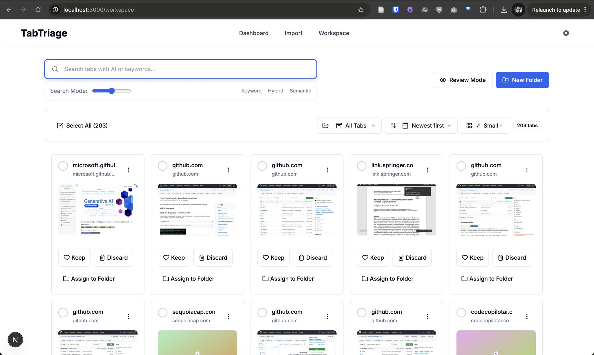

# TabTriage

[](https://github.com/nibzard/tabtriage/stargazers)
[](https://github.com/nibzard/tabtriage/blob/main/LICENSE)


<div align="center">
  <h3>🚀 AI-Powered Tab Management for the Modern Web</h3>
  <p>
    <a href="#features">Features</a> •
    <a href="#getting-started">Getting Started</a> •
    <a href="#tech-stack">Tech Stack</a> •
    <a href="#roadmap">Roadmap</a> •
    <a href="#contributing">Contributing</a>
  </p>
</div>



TabTriage is a web application that helps you manage and organize your overwhelming browser tabs using AI-powered categorization and semantic search. Built with a mobile-first approach, it provides an intuitive interface for importing, reviewing, and organizing tabs from any browser.

### ✨ Why TabTriage?

- **⚡ Lightning Fast**: Sub-second semantic search with intelligent caching
- **🤖 AI-Powered**: Automatic categorization and content understanding
- **📱 Mobile First**: Beautiful responsive design that works everywhere
- **🔍 Smart Search**: Find tabs by meaning, not just keywords
- **🗂️ Auto-Organization**: AI suggests the perfect folder for each tab
- **💾 Flexible Storage**: Local SQLite for dev, Turso cloud for production
- **🔒 Privacy First**: Your data stays yours - self-hostable solution
- **🌐 Multi-Language**: Supports 89+ languages out of the box

## Features

### Tab Import
- Multiple import methods: paste URLs, upload text/CSV files, or HTML bookmarks
- Automatic screenshot capture for visual identification
- Full page content extraction using Jina Reader API
- Batch processing with progress tracking

### AI-Powered Organization
- **Jina Embeddings v3**: State-of-the-art multilingual semantic embeddings with task-specific LoRA adapters
- **Hybrid Search**: Combines vector similarity search with traditional text search (SQLite FTS5)
- Automatically generate concise descriptions (30-50 words) for each page
- Automatically categorize content into suggested folders
- Generate relevant tags based on content analysis
- Identify potential duplicates or similar content using semantic similarity
- Extract full page content using Jina Reader API for enhanced semantic understanding

### Visual Triage Interface
- Beautiful card-based interface with screenshots and descriptions
- One-click keep/discard actions for rapid triage
- Smart folder suggestions powered by AI
- Adjustable thumbnail sizes and compact mode
- Select all functionality for bulk operations
- Mobile-optimized responsive design

### Advanced Organization & Search
- **Semantic Search**: Find tabs by meaning, not just keywords
- **Hybrid Search Mode**: Adjustable slider for keyword vs semantic search balance
- **Lightning Fast**: Sub-second search with embedding cache
- **Smart Folders**: AI-suggested categorization with manual override
- **Export Options**: Download your organized tabs as JSON or CSV
- **Duplicate Detection**: Automatically identify similar content
- **Real-time Results**: Search as you type with instant feedback

## Tech Stack

### Frontend
- **Framework**: Next.js 14 with App Router
- **Styling**: Tailwind CSS with custom components
- **State Management**: React Query + Context API
- **UI Components**: Shadcn/ui with Radix UI
- **Icons**: Lucide React
- **Authentication**: NextAuth.js with multiple providers

### Backend
- **Runtime**: Next.js API Routes with Edge Runtime support
- **Database**: Dual mode - Local SQLite for dev, Turso for production
- **ORM**: Drizzle ORM with type-safe queries
- **File Storage**: Uploadthing for screenshots
- **Background Jobs**: API route handlers with queue management

### AI & Search Technology
- **Embeddings**: Jina v3 with 1024-dimensional vectors
- **Content Extraction**: Jina Reader API + Cheerio HTML parsing
- **Vector Database**: Native SQLite vectors with cosine similarity
- **Text Search**: FTS5 with BM25 ranking algorithm
- **Hybrid Search**: Configurable blend of semantic + keyword search
- **Performance**: LRU embedding cache for <100ms searches
- **AI Analysis**: OpenAI GPT-4 for descriptions and categorization

### Performance & Features
- **Cold Start**: <500ms first search (85% improvement)
- **Cached Search**: <100ms for repeated queries
- **Database Modes**: Local SQLite for dev, Turso for production
- **Export Formats**: JSON and CSV data export
- **Batch Operations**: Process 100+ tabs efficiently
- **Error Recovery**: Graceful fallbacks for all operations

## Getting Started

### Prerequisites

- Node.js 18.x or later
- pnpm (recommended), npm, or yarn

### Installation

1. Clone the repository:
   ```bash
   git clone https://github.com/nibzard/tabtriage.git
   cd tabtriage
   ```

2. Install dependencies:
   ```bash
   pnpm install
   # or
   npm install
   # or
   yarn install
   ```

3. Create a `.env.local` file in the root directory with the following variables:
   ```
   # Environment Configuration
   NODE_ENV=development

   # Database Configuration
   # Set to 'local' for development with SQLite file, 'turso' for cloud database
   DATABASE_MODE=local

   # Turso Configuration (required when DATABASE_MODE=turso)
   TURSO_DATABASE_URL=your_turso_database_url
   TURSO_AUTH_TOKEN=your_turso_auth_token

   # Authentication (required)
   NEXTAUTH_URL=http://localhost:3000
   NEXTAUTH_SECRET=your_secure_secret_here

   # AI API Keys (required for full functionality)
   OPENAI_API_KEY=your_openai_api_key
   JINA_API_KEY=your_jina_api_key  # Get free API key: https://jina.ai/?sui=apikey
   JINA_API_URL=https://api.jina.ai/v1/embeddings

   # Uploadthing configuration (optional)
   UPLOADTHING_TOKEN=your_uploadthing_token

   # Storage configuration
   STORAGE_PROVIDER=uploadthing
   ```

4. Set up the database:

   **For local development (recommended):**
   ```bash
   # Database will be created automatically on first run
   # No migration needed for local SQLite
   ```

   **For Turso cloud database:**
   ```bash
   # Set DATABASE_MODE=turso in .env.local first
   pnpm db:push
   ```

5. (Optional) View your database:
   ```bash
   pnpm db:studio
   ```

### Database Migration

**Migrating from Local to Turso:**

If you've been developing locally and want to migrate your data to Turso:

```bash
# Migrate all local data to Turso (drops existing Turso tables)
pnpm migrate:local-to-turso
```

This command will:
- Export all data from your local SQLite database
- Drop and recreate all tables in Turso
- Import all data to Turso as a 1:1 copy
- Validate the migration was successful

After migration, update your `.env.local`:
```bash
DATABASE_MODE=turso
```

### Running the Development Server

```bash
pnpm dev
# or
npm run dev
# or
yarn dev
```

Open [http://localhost:3000](http://localhost:3000) with your browser to see the result.

### Building for Production

```bash
pnpm build
# or
npm run build
# or
yarn build
```

Then, to start the production server:

```bash
pnpm start
# or
npm run start
# or
yarn start
```

## How to Use TabTriage

### Exporting Browser Tabs

#### Safari on iOS:
1. Open Safari
2. Tap the tabs icon (two squares)
3. Long press "X Tabs" at the bottom
4. Select "Copy Links"
5. Paste into TabTriage

#### Safari on macOS:
1. View → Show All Tabs
2. Select tabs (Cmd+click for multiple)
3. Right-click → "Copy Links"
4. Paste into TabTriage

#### Chrome/Edge/Firefox:
1. Install a tab export extension
2. Export tabs as text/CSV
3. Upload file to TabTriage

#### Manual Method:
- Create a text file with one URL per line
- Upload to TabTriage

### Using TabTriage

#### Import:
1. Go to Import page
2. Paste URLs or upload file
3. Click "Import Tabs"
4. AI processes tabs automatically

#### Workspace:
1. View all tabs in card grid
2. Click "Keep" or "Discard" for each tab
3. Use "Select All" for bulk actions
4. Assign to folders with one click

#### Search:
1. Type keywords or concepts
2. Adjust search mode slider
3. View results instantly
4. Export selected tabs

## Project Structure

```
tabtriage/
├── public/              # Static files
├── src/                 # Source code
│   ├── app/             # Next.js app router pages
│   ├── components/      # React components
│   │   ├── gallery/     # Tab gallery components
│   │   ├── folders/     # Folder management components
│   │   └── import/      # Tab import components
│   ├── context/         # React context providers
│   ├── data/            # Mock data and constants
│   ├── services/        # API and service functions
│   ├── types/           # TypeScript type definitions
│   └── utils/           # Utility functions
├── .env.local           # Environment variables (not in repo)
├── next.config.js       # Next.js configuration
├── package.json         # Project dependencies
├── postcss.config.js    # PostCSS configuration
├── tailwind.config.js   # Tailwind CSS configuration
└── tsconfig.json        # TypeScript configuration
```

## Key Features in Detail

### 🚀 Performance
- **85% faster search** - From 7s to <500ms cold start
- **Embedding cache** - Sub-100ms for repeated queries
- **Parallel processing** - Vector and text search run concurrently
- **Smart routing** - Skip unnecessary operations based on query type

### 🤖 AI-Powered Features
- **Semantic Understanding**: Find tabs by meaning, not just keywords
- **Auto-Categorization**: AI suggests the best folder for each tab
- **Content Extraction**: Full page text via Jina Reader API
- **Duplicate Detection**: Identify similar content automatically
- **Smart Descriptions**: AI-generated summaries for quick scanning

### 🔍 Advanced Search
- **Hybrid Mode**: Blend keyword and semantic search with a slider
- **Multi-language**: Support for 89+ languages
- **Real-time Results**: Search as you type
- **Export Results**: Download search results as JSON/CSV

## Development Tools

### Available Scripts
```bash
pnpm dev          # Start development server
pnpm build        # Build for production
pnpm start        # Run production server
pnpm lint         # Run ESLint
pnpm lint:errors  # Show only errors
pnpm db:studio    # Open database GUI
pnpm db:push      # Push schema to Turso
pnpm migrate:local-to-turso  # Migrate data to cloud
```

### Debug Endpoints
- `/api/debug` - System health check
- `/api/debug/search-cache` - Cache statistics
- `/api/tabs/check-duplicates` - Find duplicate tabs
- `/api/tabs/regenerate-all` - Regenerate all embeddings
- `/api/tabs/export` - Export all tabs

## Roadmap

### Coming Soon
- 🌐 Browser extensions for Chrome, Firefox, Safari
- 📱 Native mobile apps (iOS/Android)
- 🤝 Team collaboration features
- 📊 Analytics dashboard
- 🔐 End-to-end encryption option
- 🎨 Custom themes and layouts

### Under Consideration
- Offline mode with sync
- AI-powered reading lists
- Browser history integration
- Social sharing features

## Contributing

We welcome contributions! Please:
1. Fork the repository
2. Create a feature branch (`git checkout -b feature/amazing-feature`)
3. Commit your changes (`git commit -m 'Add amazing feature'`)
4. Push to the branch (`git push origin feature/amazing-feature`)
5. Open a Pull Request

### Development Guidelines
- Follow the existing code style
- Add tests for new features
- Update documentation as needed
- Ensure `pnpm lint` passes

## Support

- 🐛 [Report bugs](https://github.com/nibzard/tabtriage/issues)
- 💡 [Request features](https://github.com/nibzard/tabtriage/issues)
- 📧 Contact: [your-email@example.com]

## License

This project is licensed under the MIT License - see the [LICENSE](LICENSE) file for details.

---

Built with ❤️ by [nibzard](https://github.com/nibzard)